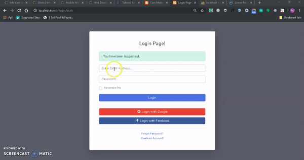

## admin_panel
Pengelolaan data admin, user and  simple ecommers mengunakan codeigniter

## preview

## Screenshot

************
Installation
************

Please see the `installation section <https://codeigniter.com/user_guide/installation/index.html>`_
of the CodeIgniter User Guide.

*******
License
*******

Please see the `license
agreement <https://github.com/bcit-ci/CodeIgniter/blob/develop/user_guide_src/source/license.rst>`_.

*********
Resources
*********

-  `User Guide <https://codeigniter.com/docs>`_
-  `Language File Translations <https://github.com/bcit-ci/codeigniter3-translations>`_
-  `Community Forums <http://forum.codeigniter.com/>`_
-  `Community Wiki <https://github.com/bcit-ci/CodeIgniter/wiki>`_
-  `Community Slack Channel <https://codeigniterchat.slack.com>`_

Report security issues to our `Security Panel <mailto:security@codeigniter.com>`_
or via our `page on HackerOne <https://hackerone.com/codeigniter>`_, thank you.

***************
Acknowledgement
***************

The CodeIgniter team would like to thank EllisLab, all the
contributors to the CodeIgniter project and you, the CodeIgniter user.
